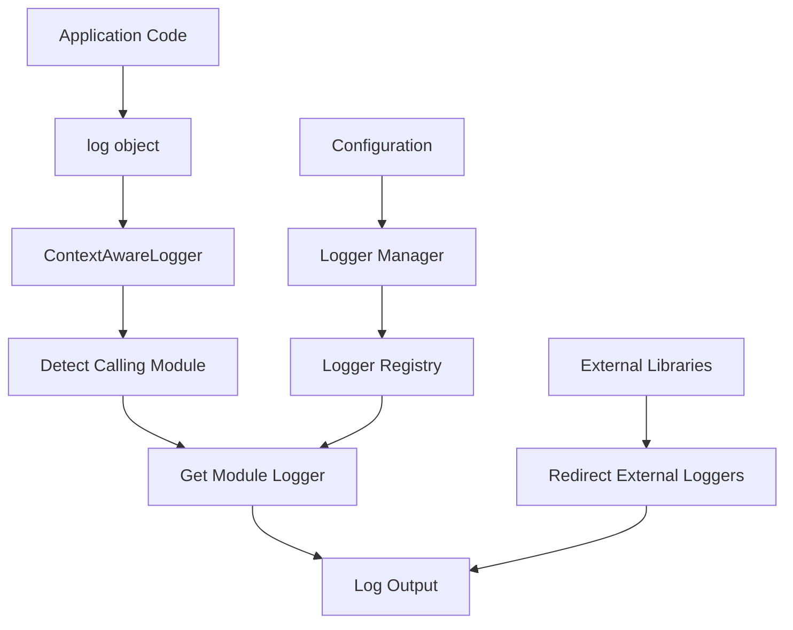

# OARC-Log Specification

## Overview

OARC-Log is a context-aware logging system for Python applications, providing centralized, consistent logging with automatic module detection. It's designed to streamline logging across application components while maintaining clarity about the source of each log message.

## Architecture

The logging system is built around two main components:

1. **ContextAwareLogger** - A wrapper class that automatically determines the calling module
2. **Logger** - A singleton manager that handles initialization and configuration



## Key Features

- **Context-Aware Logging**: Automatically identifies the calling module
- **Centralized Configuration**: One-time setup affects all loggers
- **External Library Integration**: Redirects common library logs
- **Singleton Pattern**: Prevents duplicate initialization
- **Debug Mode Toggle**: Easily switch between normal and verbose logging
- **Standard Python Logging**: Built on the Python standard library

## Core Components

### ContextAwareLogger

This class wraps standard Python loggers and adds context awareness by automatically detecting which module is making the logging call.

#### Methods

- `debug(msg, *args, **kwargs)`: Log at DEBUG level
- `info(msg, *args, **kwargs)`: Log at INFO level
- `warning(msg, *args, **kwargs)`: Log at WARNING level 
- `error(msg, *args, **kwargs)`: Log at ERROR level
- `critical(msg, *args, **kwargs)`: Log at CRITICAL level
- `exception(msg, *args, **kwargs)`: Log exception with traceback
- `is_debug_enabled()`: Check if debug logging is enabled

### Logger

A singleton class that manages the initialization and configuration of the logging system.

#### Class Methods

- `initialize()`: Initialize the logging system
- `get_logger(name=None)`: Get a logger by name
- `redirect_external_loggers(*module_names, level=logging.WARNING)`: Configure external loggers
- `enable_debug_logging(ctx=None, param=None, value=None)`: Enable debug logging
- `is_debug_enabled()`: Check if debug logging is enabled

## Configuration

By default, the logging system:

1. Sets the root logger's level to INFO
2. Configures a StreamHandler to stderr
3. Uses a format of '%(asctime)s - %(name)s - %(levelname)s - %(message)s'
4. Sets datetime format to '%Y-%m-%d %H:%M:%S'
5. Prevents logger propagation to avoid duplicate logs

## Usage Patterns

### Basic Logging

```python
from oarc_log import log

log.info("Application started")
log.debug("Detailed information")  # Only outputs when debug enabled
log.error("Something went wrong")
```

### Module-Specific Loggers

```python
from oarc_log import get_logger

# Get a logger for a specific component
logger = get_logger("my_component")
logger.info("Component initialized")
```

### Integration with Click CLI

```python
import click
from oarc_log import enable_debug_logging

@click.command()
@click.option("--verbose", is_flag=True, callback=enable_debug_logging, 
              help="Enable debug logging")
def cli(verbose):
    # Logging will be set to DEBUG if --verbose flag is used
    pass
```

### External Library Logging

```python
from oarc_log import redirect_external_loggers

# Redirect and lower verbosity of external libraries
redirect_external_loggers("requests", "urllib3", level=logging.WARNING)
```

## Implementation Details

### Logger Discovery

The context-aware logger uses Python's `inspect` module to walk the call stack and find the first module outside of the logging module itself.

### Singleton Pattern

The `Logger` class uses class variables and methods to maintain a single instance of the logging configuration across the application.

### Thread Safety

The logging system relies on the thread safety of Python's standard logging module for concurrent access.

## Best Practices

1. Import and use the `log` object directly in most cases
2. Use `get_logger()` when you need specific control over a component's logs
3. Call `enable_debug_logging()` early in application startup for verbose mode
4. Use `redirect_external_loggers()` to control noisy third-party libraries
5. Include context in log messages to aid troubleshooting
